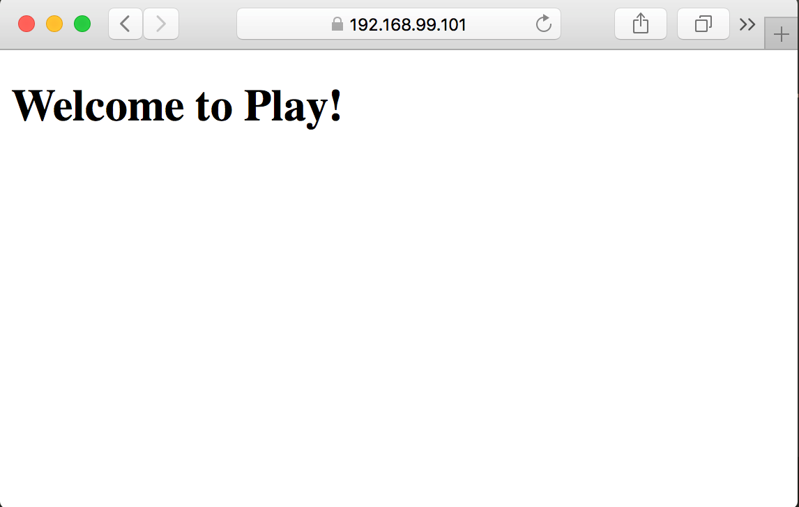

# sbt Example: Play on Minikube

@@include[deprecation.md](deprecation.md)

### Prerequisites

* [reactive-cli](../setup/cli-installation.html) installed
* Java
* sbt

### Install Docker CE

Follow the instruction on [About Docker CE][docker-ce] to install Docker.

### Install kubectl

Follow the instruction on [Install and Set Up kubectl][install-kubectl].

### Install Minikube

Follow the instruction on [Minikube][minikube] repository to install it. For macOS it's:

```bash
brew cask install minikube
```

### Confirm installation

```bash
docker --version

Docker version 18.03.1-ce, build 9ee9f40

kubectl version

Client Version: version.Info{Major:"1", Minor:"9", GitVersion:"v1.9.3", GitCommit:"d2835416544f298c919e2ead3be3d0864b52323b", GitTreeState:"clean", BuildDate:"2018-02-09T21:51:54Z", GoVersion:"go1.9.4", Compiler:"gc", Platform:"darwin/amd64"}
Server Version: version.Info{Major:"1", Minor:"10", GitVersion:"v1.10.0", GitCommit:"fc32d2f3698e36b93322a3465f63a14e9f0eaead", GitTreeState:"clean", BuildDate:"2018-03-26T16:44:10Z", GoVersion:"go1.9.3", Compiler:"gc", Platform:"linux/amd64"}

minikube version

minikube version: v0.28.0
```

### Create a new Play application

```bash
sbt new playframework/play-scala-seed.g8

This template generates a Play Scala project

name [play-scala-seed]: hello-play
organization [com.example]:
play_version [2.6.16]:
sbt_version [1.1.6]:
scalatestplusplay_version [3.1.2]:

Template applied in ./hello-play
```

### Project setup

Add the sbt-reactive-app plugin to your project's `project/plugins.sbt` file:

@@@vars
```scala
addSbtPlugin("com.lightbend.rp" % "sbt-reactive-app" % "$sbtreactiveapp$")
```
@@@

Edit `build.sbt` to include `SbtReactiveAppPlugin`:

```scala
lazy val root = (project in file("."))
  .enablePlugins(PlayScala, SbtReactiveAppPlugin)
```

### Declare endpoint

Add the following to `build.sbt` to declare an endpoint:

```scala
rpHttpIngressPaths := Seq("/")
```

### conf/application.conf

Create `conf/application.conf` with the following content:

```
play.filters.hosts {
  allowed = ["."]
}
# https://www.playframework.com/documentation/latest/Configuration
play.http.secret.key="something"
```

#### Start Minikube

macOS / Linux
:  ```bash
    minikube start
    eval $(minikube docker-env)
    ```

Windows
:  ```powershell
    minikube start
    minikube docker-env | Invoke-Expression
```

### Deploy to Minikube

Within the same terminal window, start the sbt shell:

```
sbt
```

In the sbt shell type the following:

```
compile
rpDeploy minikube
```

If successful you should see an output like the following:

```
[info] role "pod-reader" deleted
[info] rolebinding "read-pods" deleted
[info] role "pod-reader" created
[info] rolebinding "read-pods" created
[info] Sending build context to Docker daemon   39.8MB
[info] Step 1/18 : FROM openjdk:8-jre-alpine as stage0
[info]  ---> 1b46cc2ba839
[info] Step 2/18 : WORKDIR /opt/docker
[info]  ---> Using cache
[info]  ---> 09025e8e896f
[info] Step 3/18 : COPY opt /opt
[info]  ---> 41910154fdb0
[info] Step 4/18 : USER root
[info]  ---> Running in 3ab0acf54f8a
[info] Removing intermediate container 3ab0acf54f8a
[info]  ---> 0dab44ea6534
[info] Step 5/18 : RUN ["chmod", "u+x,g+x", "/opt/docker/bin/rp-start"]
[info]  ---> Running in dbd18c8e426c
[info] Removing intermediate container dbd18c8e426c
[info]  ---> 05ded6c3ef75
[info] Step 6/18 : RUN ["chmod", "u+x,g+x", "/opt/docker/bin/hello-play"]
[info]  ---> Running in fe539093a368
[info] Removing intermediate container fe539093a368
[info]  ---> f97385d94c10
[info] Step 7/18 : RUN ["chmod", "-R", "u=rX,g=rX", "/opt/docker"]
[info]  ---> Running in aad61c2a021d
[info] Removing intermediate container aad61c2a021d
[info]  ---> 56e5614e7ceb
[info] Step 8/18 : RUN ["chmod", "u+x,g+x", "/opt/docker/bin/hello-play"]
[info]  ---> Running in 96c592352792
[info] Removing intermediate container 96c592352792
[info]  ---> 32e25c132e35
[info] Step 9/18 : FROM openjdk:8-jre-alpine
[info]  ---> 1b46cc2ba839
[info] Step 10/18 : RUN /sbin/apk add --no-cache bash shadow
[info]  ---> Using cache
[info]  ---> b326fe4140ff
[info] Step 11/18 : USER root
[info]  ---> Using cache
[info]  ---> b66a68b58e10
[info] Step 12/18 : RUN id -u demiourgos728 2> /dev/null || useradd --system --create-home --uid 1001 --gid 0 demiourgos728
[info]  ---> Using cache
[info]  ---> b497e918678b
[info] Step 13/18 : WORKDIR /opt/docker
[info]  ---> Using cache
[info]  ---> 67f1ad3cb366
[info] Step 14/18 : COPY --from=stage0 --chown=demiourgos728:root /opt/docker /opt/docker
[info]  ---> 257b8e7fadbf
[info] Step 15/18 : USER 1001
[info]  ---> Running in 5dde95c62cf9
[info] Removing intermediate container 5dde95c62cf9
[info]  ---> 21bec7c58c83
[info] Step 16/18 : ENTRYPOINT ["/opt/docker/bin/rp-start", "/opt/docker/bin/hello-play"]
[info]  ---> Running in 334b03a2d1b7
[info] Removing intermediate container 334b03a2d1b7
[info]  ---> 4fc3c29ec268
[info] Step 17/18 : CMD []
[info]  ---> Running in 85e135d0934d
[info] Removing intermediate container 85e135d0934d
[info]  ---> 389dc57f9a03
[info] Step 18/18 : LABEL com.lightbend.rp.app-name="hello-play" com.lightbend.rp.applications.0.name="default" com.lightbend.rp.applications.0.arguments.0="/opt/docker/bin/rp-start" com.lightbend.rp.applications.0.arguments.1="bin/hello-play" com.lightbend.rp.app-version="1.0-SNAPSHOT" com.lightbend.rp.app-type="basic" com.lightbend.rp.config-resource="rp-application.conf" com.lightbend.rp.modules.akka-cluster-bootstrapping.enabled="false" com.lightbend.rp.modules.akka-management.enabled="false" com.lightbend.rp.modules.common.enabled="true" com.lightbend.rp.modules.secrets.enabled="false" com.lightbend.rp.modules.service-discovery.enabled="false" com.lightbend.rp.modules.status.enabled="false" com.lightbend.rp.endpoints.0.name="http" com.lightbend.rp.endpoints.0.protocol="http" com.lightbend.rp.endpoints.0.port="9000" com.lightbend.rp.endpoints.0.ingress.0.type="http" com.lightbend.rp.endpoints.0.ingress.0.ingress-ports.0="80" com.lightbend.rp.endpoints.0.ingress.0.ingress-ports.1="443" com.lightbend.rp.endpoints.0.ingress.0.paths.0="/" com.lightbend.rp.sbt-reactive-app-version="1.7.1"
[info]  ---> Running in 7422665243f3
[info] Removing intermediate container 7422665243f3
[info]  ---> 70d6df4c05a4
[info] Successfully built 70d6df4c05a4
[info] Successfully tagged hello-play:1.0-SNAPSHOT
[info] Built image hello-play:1.0-SNAPSHOT
[info] deployment "hello-play-v1-0-snapshot" deleted
[info] service "hello-play" deleted
[info] ingress "hello-play" deleted
[info] deployment "hello-play-v1-0-snapshot" created
[info] service "hello-play" created
[info] ingress "hello-play" created
```

Exit sbt shell:

```
exit
```

### Confirm Play application

Type `minikube ip` to find out the IP address of Minikube:

```bash
minikube ip

192.168.99.101
```

Open the IP address in your browser, and say yes to ignoring the certificate not matching up.



Now you have Play application running on Minikube.

  [minikube]: https://github.com/kubernetes/minikube
  [install-kubectl]: https://kubernetes.io/docs/tasks/tools/install-kubectl/
  [docker-ce]: https://docs.docker.com/install/
