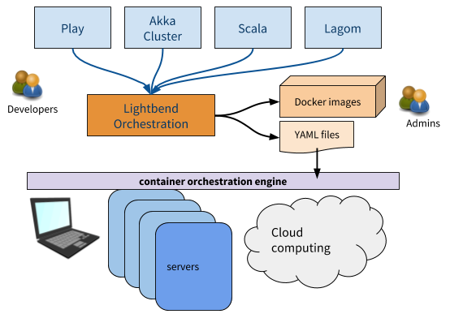

# Lightbend Orchestration

Lightbend Orchestration is a developer-centric suite of tools that helps you deploy [Reactive Platform](https://www.lightbend.com/products/reactive-platform) applications to Kubernetes and DC/OS. It provides an easy way to create Docker images for your applications and introduces an automated process for generating Kubernetes and DC/OS resource and configuration files for you from those images. This process helps reduce the friction between development and operations.

### Status of Lightbend Orchestration

Lightbend Orchestration is currently a Technology Preview. We encourage using this during development on Minikube, but integration with any other deployment targets including Kubernetes and DC/OS are currently at **Incubating** stage.

@@toc { .main depth=3 }

@@@ index

* [Overview](overview.md)
* [Getting Started](getting-started/start.md)
* [Setup](setup/setup.md)
* [Building & Publishing](building.md)
* [Kubernetes Development](kubernetes-development.md)
* [Kubernetes Deployment](kubernetes-deployment.md)
* [DC/OS Deployment](dcos-deployment.md)
* [Features](features/features.md)
* [Examples](examples.md)
* [Release Notes](release-notes.md)

@@@
